layout: true

  

 

---

# What is a Causal Statement?

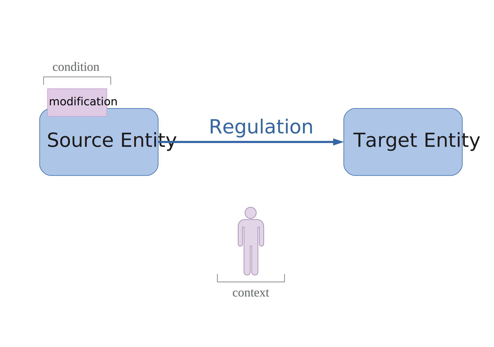

---

# Causal statements in modeling

.center[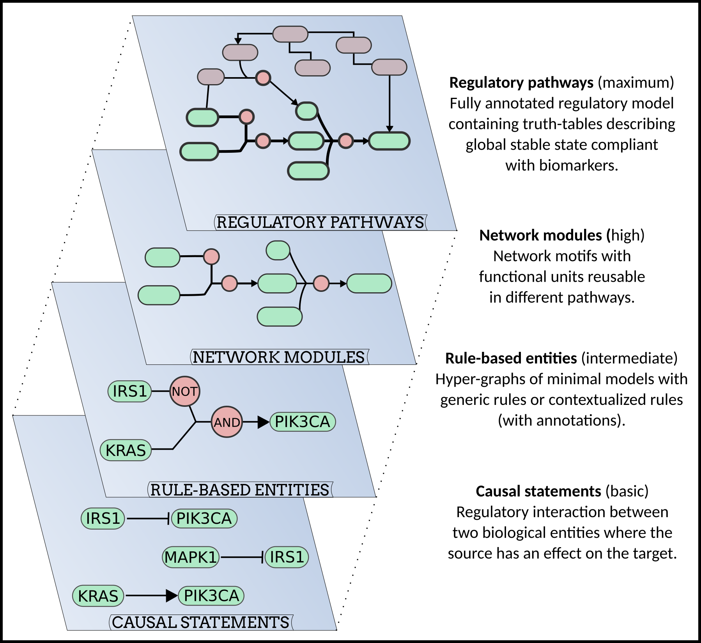]

---

# Current representations of causal statements

.pull-left[
* SIF  
  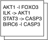
]

.pull-right[ 
* MITAB2.8  
 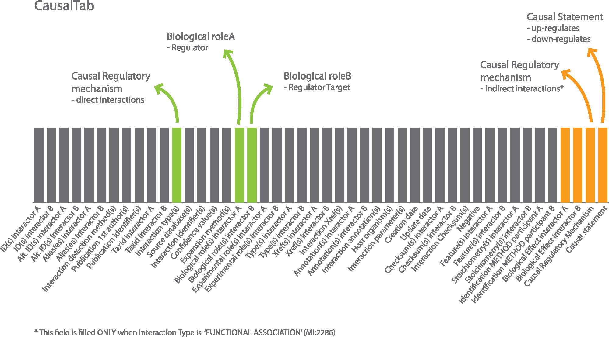
 .small[
 source: [Perfetto et al. 2019](https://doi.org/10.1093/bioinformatics/btz132)
 ]

]
---
count:false

# Current representations of causal statements

.pull-left[
* SIF  
  
          
* BEL 
 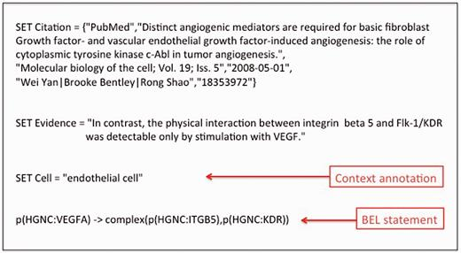
 .small[
 source: [Fluck et al. 2016](https://doi.org/10.1093/database/baw113)
 ]
]

.pull-right[ 
* MITAB2.8  
 
 .small[
 source: [Perfetto et al. 2019](https://doi.org/10.1093/bioinformatics/btz132)
 ]
   
* GO-CAM  
 
 .small[
 source: [GO-CAM website](https://geneontology.cloud/home)
 ]
]

---

# MI2CAST: from a checklist to guidelines

## List of data to annotate about a causal interaction    

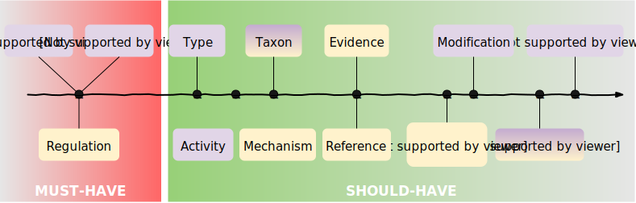

 

`r shiny::icon("arrow-circle-right")` Arranged in guidelines with ontologies & CVs recommendations

---

# MI2CAST guidelines defines 4 rules
Rule 1. Source and Target entity must be annotated  

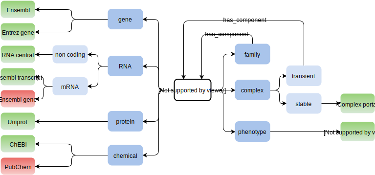

---
count:false

# MI2CAST guidelines defines 4 rules
Rule 1. Source and Target entity must be annotated  

Rule 2. Regulation sign must be annotated

.pull-left-large[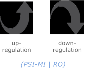]
.pull-right-small[

]

---
count:false
# MI2CAST guidelines defines 4 rules
Rule 1. Source and Target entity must be annotated  

Rule 2. Regulation sign must be annotated  

Rule 3. Origin of interaction should be annotated  

.pull-left-large[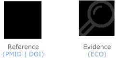]

---
count:false
# MI2CAST guidelines defines 4 rules
Rule 1. Source and Target entity must be annotated  

Rule 2. Regulation sign must be annotated  

Rule 3. Origin of interaction should be annotated  

Rule 4. Context of interaction should be specified  

.pull-left-large[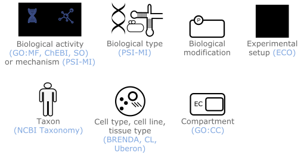]

---
count:false
# MI2CAST guidelines defines 4 rules
Rule 1. Source and Target entity must be annotated  

Rule 2. Regulation sign must be annotated  

Rule 3. Origin of interaction should be annotated  

Rule 4. Context of interaction should be specified 

 
 

`r shiny::icon("arrow-circle-right")` MI2CAST on  GitHub `r shiny::icon("github")` : [vtoure/MI2CAST](https://github.com/vtoure/MI2CAST)  

`r shiny::icon("arrow-circle-right")` Manuscript in preparation!
---

# Coverage of MI2CAST

.center[

| Term                    |  SIF  |  MITAB2.8  |  BEL  |  GO-CAM  |
|-------------------------|-----|----------|-----|--------|
| source entity           |  *  |     *    |  *  |    *   |
| target entity           |  *  |     *    |  *  |    *   |
| regulation sign         |  *  |     *    |  *  |    *   |
| reference               |     |     *    |  *  |    *   |
| evidence                |     |     *    |  *  |    *   |
| biological activity     |     |     *    |  *  |    *   |
| biological mechanism    |     |     *    |     |    *   |
| biological type         |     |     *    |  *  |        |
| taxon entity            |     |     *    |     |    *   |
| experimental setup      |     |     *    |     |        |
| biological modification |     |     *    |  *  |        |
| taxon interaction       |     |     *    |  *  |        |
| cell line               |     |          |  *  |        |
| tissue type             |     |          |     |    *   |
| cell type               |     |          |  *  |    *   |
| compartment             |     |          |  *  |    *   |
]

---

# MI2CAST's added-value

.pull-left-small[
`r shiny::icon("search")` Guide curators for contextual annotation  

`r shiny::icon("microscope")` Guide biologists for experimental design  

`r shiny::icon("project-diagram")` Data consistency for model building 
]

.pull-right-large[ ]

---
# Concrete biological examples

* [Transcription factor target gene interaction](https://github.com/vtoure/MI2CAST/blob/master/examples/TF-TG.md)

| Term                         | Identifier | Name/Label                                     | Database                          |
|------------------------------|------------|------------------------------------------------|-----------------------------------|
| source                       | A0AVK6     | E2F8                                           | Uniprot                           |
| target                       | 898        | CCNE1                                          | Entrez gene                       |
| regulation sign              | 2240       | down-regulates                                 | PSI-MI                            |
| reference                    | 16179649   | "Characterization of E2F8, a novel..."         | Pubmed                            |
| evidence 1                   | 0000269    | exp. evidence used in manual assertion         | ECO                               |
| evidence 2                   | 0001805    | luciferase reporter gene assay evidence        | ECO                               |
| biological mechanism         | 2247       | transcription regulation                       | PSI-MI                            |
| compartment (interaction)    | 0005634    | nucleus                                        | GO:CC                             |
| taxon                        | 9606       | Homo sapiens                                   | NCBI taxonomy                     |
| cell line                    | 0001938    | human osteosarcoma cell line                   | BTO                               |
| exp. setup source 1          | 0506       | over expressed level                           | PSI-MI                            |
| exp. setup source 2          | 0331       | engineered                                     | PSI-MI                            |
| exp. setup target 1          | 0331       | engineered                                     | PSI-MI                            |
| exp. setup target 2          | 0001679    | transcription\_regulatory\_region              | SO                                |

---

# Concrete biological examples

* [Protein kinase A regulation](https://github.com/vtoure/MI2CAST/blob/master/examples/PKA_regulation.md)

| Term                         | Identifier | Name/Label                                     | Database                          |
|------------------------------|------------|------------------------------------------------|-----------------------------------|
| source                       | 17489      | 3',5'-cyclic AMP                               | ChEBI                             |
| target                       | P17612     | cAMP-dependent PKA catalytic                   | Uniprot                           |
| regulation sign              | 2236       | up-regulates activity                          | PSI-MI                            |
| reference                    | 26687711   | "Protein kinase A catalytic subunit... "       | Pubmed                            |
| evidence                     | 0000302    | author statement used in manual assertion      | ECO                               |
| biological activity source   | 0034237    | protein kinase A regulatory subunit binding    | GO:MF                             |
| biological activity target   | 0004672    | protein kinase activity                        | GO:MF                             |
| compartment of interaction   | 0005737    | cytoplasm                                      | GO:CC                             |
| taxon                        | 9606       | Homo sapiens                                   | NCBI taxonomy                     |

---

# MI2CAST support with the [causalBuilder](https://vtoure.github.io/causalBuilder/)
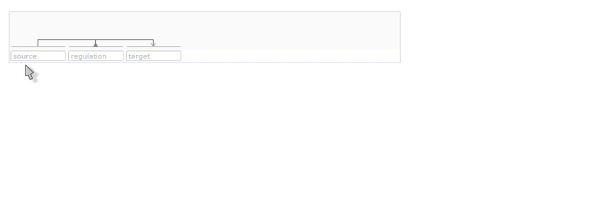

* Exports: causal-JSON + [MITAB2.8](https://psicquic.github.io/MITAB28Format.html) (planned)
* Autocomplete for >800 ontologies with [VSM-dictionary-combiner](https://github.com/vsmjs/vsm-dictionary-combiner)

.medium[
Use of [VSM technology](https://github.com/vsmjs/) & GitHub pages ([Jekyll Cayman theme](https://github.com/pages-themes/cayman))]

---

# Acknowledgements

.pull-left-large[
  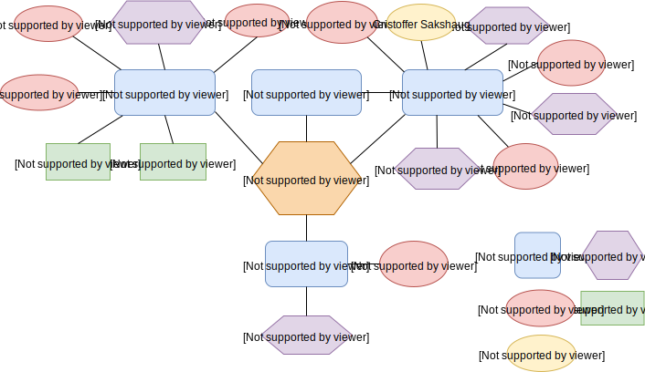
  ]
  
.pull-right-small[
  
  
  
  
  
  
  

]

  `r shiny::icon("github")`  [vtoure](https://github.com/vtoure/)  
  `r shiny::icon("twitter")` [@Vsndr_T](https://twitter.com/Vsndr_T)

.small[Slides created via the R package [**xaringan**](https://github.com/yihui/xaringan).]

---

# List of abbreviations

.medium[
* MI2CAST &nbsp; Minimum Information about a Molecular Interaction Causal Statement 
* BEL &nbsp; Biological Expression Language  
* GO-CAM &nbsp; Gene Ontology Causal Activity Model  
* PSI-MI &nbsp; Proteomics Standards Initiative Molecular Interactions  
* RO &nbsp; Relation Ontology  
* PMID &nbsp; Pubmed Identifier  
* DOI &nbsp; Digital Object Identifier  
* ECO &nbsp; Evidence and Conclusion Ontology  
* GO:MF &nbsp; Gene Ontology Molecular Function  
* ChEBI &nbsp; Chemical Entities of Biological Interest  
* SO &nbsp; Sequence Ontology  
* BTO &nbsp; BRENDA Tissue Ontology  
* CL &nbsp; Cell Ontology  
* Uberon &nbsp; Uber Anatomy Ontology  
* GO:CC &nbsp; Gene Ontology Cellular Component  
]
